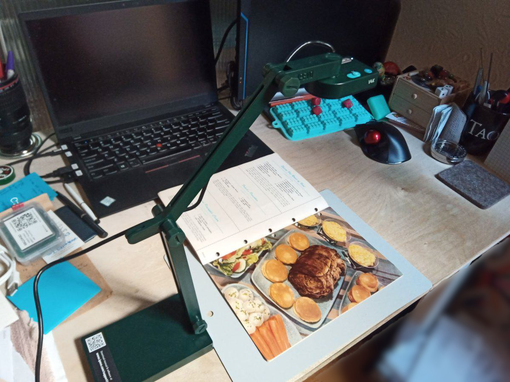

Ipevo Tooling
--------------

I have an Ipevo V4K document camera that I want to use for digitizing books
controlled from a Linux computer. Ipevo has software for Linux, but it's not
great. This is my first stab at a more script friendly interface.

Basic workflow works like this:

0. Install the Ipevo Visualizer package.
   https://www.ipevo.com/software/visualizer
   https://web.archive.org/web/20230430235444/https://www.ipevo.com/software/visualizer
   https://web.archive.org/web/20230430235544/https://ipevo-api-cms.s3-us-west-1.amazonaws.com/software/visualizer/download/Linux/Visualizer_linux_1.1.4.39.zip
1. Install `imagemagick` (for the rotator tool), `img2pdf` (creates pdfs), and 
   `xdotool` (manipulates the Visualizer program). In Ubuntu that's an easy
   `apt-get install`, your distro may vary.
2. Copy the files here to your bin directory of choice. My choice is `~/bin/`
3. Make and cd into a directory to hold the project files.
   ```
   mkdir -p ~/images/first-book
   cd ~/images/first-book
   ```
4. Run the `ipevo-keyboard` tool from an xterm (or other X11 terminal)
   ```
   ipevo-keyboard
   ```
5. After start-up, you can set preferences if you like in the Ipevo program. 
   The tool will deposit preferences in an xml file in the current directory.
   I find it helpful to leave the Ipevo window in the upper left and put my
   terminal in the lower right. The `ipevo-keyboard` reads and operates on
   single characters, not complete lines, in a break from typical shell scripts.
   Usage inside the script:
   ```
   Basic operation: return to capture, q to quit.
   f to explicitly focus.
   p to take picture without waiting for focus (not stored in list)
   l to list pictures so far
   h for this help
   ```
   The script controls the Visualizer program using `xdotool` to simulate mouse
   movement and clicks plus some hard coded constants (comments in the script
   has the code I used to figure them out).
6. I take pictures in an "all odd pages", "all even pages", then "backfill
   reshoots" order.  I put the images I want to use in a file called "files",
   just regular `ls` order. I view the images in a viewer, my preference is
   `feh` and note down the page numbers in a file called "order" file. It's
   just one page number per line, for matching line in "files". There is a
   collation tool that works with this, but just putting all the images in
   page order in the "files" file works too. The `sednl` script makes it
   easy to convert `1 3 5 7 9 2 4 6 8 10` into one number per line:
   ```
   echo 1 3 5 7 9 2 4 6 8 10 | sednl > order
   ```
7. Stick metadata that `img2pdf` uses like 'title', 'subject', etc in files
   by those names. The `subject` file content will be passed in as a
   `--subject "Subject here"` line.
8. Crop and/or rotate all images if neeed. `pnginplacerotate` will automate
   clockwise (`cw`), counter-clockwise (`ccw`), and `around` rotations, eg:
   ```
   pnginplacerotate ccw *png
   ```
   For cropping, I (grudgingly) use `gimp`, generally configured with a fixed
   size crop so I can just click and drag the crop rectangle before overwriting.
9. Build the final pdf:
   ```
   mkpdfbook
   ```

Among other flaws of the Visualizer program is that it tries to make a noise
after each photo is taken, but it is inconsistent about that. It's a good idea
to operate slowly.

Eli the Bearded, 30 April 2023



Next time, I'll include less overlap between pages on the crop:

https://archive.org/details/booklet_202304/page/n11/mode/2up

